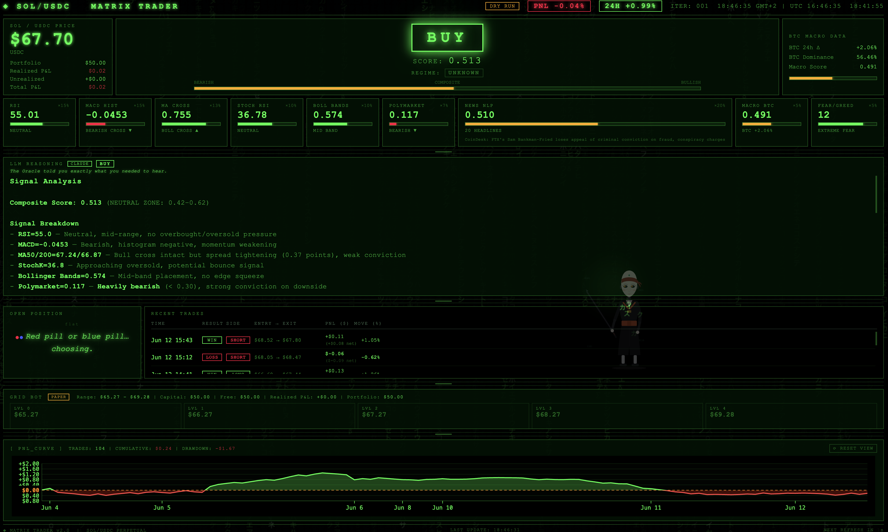
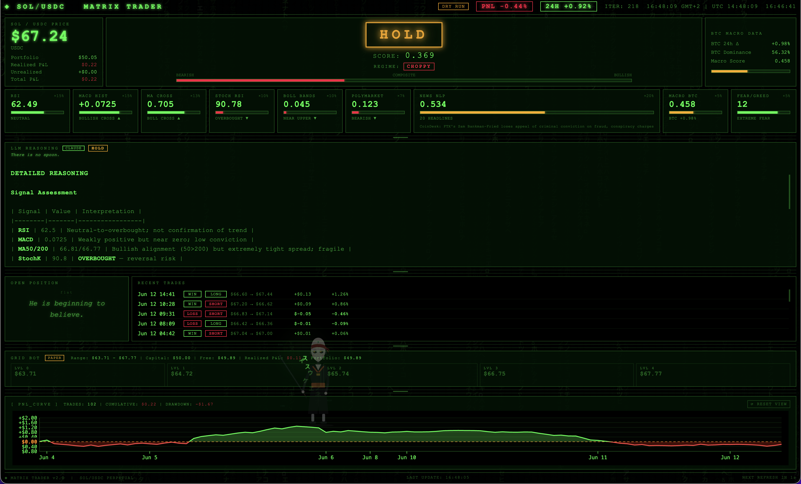
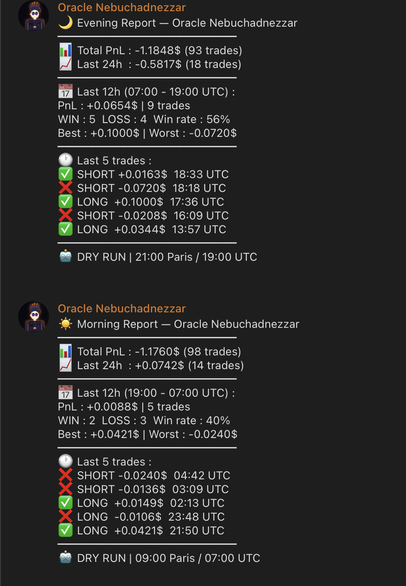

# Oracle — SOL/USDC Autonomous Trading Agent

An autonomous AI trading agent running 24/7 on a Linux VPS, where a **Claude-powered ReAct loop** makes trading decisions under the supervision of **hard-coded governance gates**. Built as a deep exploration of one question: *how do you let an LLM trade — and how do you stop it when it's wrong?*

> **Philosophy: signals propose, the LLM can refuse, the code decides.**


https://github.com/user-attachments/assets/d56fae52-928c-401f-b4fc-6b3f3fc3fa76

---

## Live Dashboard — Matrix Trader





Real-time monitoring served by the bot itself (vanilla HTML/JS, no build step):

- **Live PnL curve** — pan, wheel-zoom, crosshair tooltip, per-trade markers
- **LLM Reasoning panel** — the agent's full chain of thought for every tick, rendered as markdown, with the model source badge (CLAUDE / GROQ / FALLBACK)
- **Gate-status indicators** — when the LLM says BUY but a gate blocks it, the dashboard says so: `THE DOOR IS LOCKED, NEO` (consensus gate) or `DENIED BY THE ARCHITECT` (hard rule veto)
- **R_Pulse** — an animated avatar overlay drifting across the dashboard, reflecting live health, regime and open positions, with a particle trail and state-colored aura
- **Grid bot panel, signal bars, regime badge, BTC macro data**

Accessible locally at `http://localhost:8080`, or through an SSH tunnel when deployed:
`ssh -L 8080:localhost:8080 user@your-vps`

---

## Decision Engine — Claude + ReAct

Every 300 seconds, the agent runs a full **Observe → Reason → Act → Reflect** cycle:

| Step | What happens |
|------|--------------|
| **Observe** | Collect 9 weighted signals + market regime (ADX/ATR) + memory of recent trades |
| **Reason** | **Claude Haiku** (primary LLM) reasons across all signals with `soul.md` injected as its constitution; **Groq** serves as automatic failover if the Anthropic API is unavailable |
| **Act** | Proposed action passes through the governance gates; only then is it executed — paper account or Jupiter v6 (live) |
| **Reflect** | Full decision + reasoning logged to SQLite; risk manager updates PnL, drawdown, cooldowns |

**Identity & constitution:** [`soul.md`](soul.md) defines the agent's mission, values, and absolute rules. It is injected into every LLM prompt — the agent literally reads its own law before each decision.

**Agent memory:** `memory.md` accumulates per-trade lessons; a deeper **weekly reflection** runs on Claude Sonnet every 2016 ticks (~7 days) to extract structural insights from the week's trades.

**Self-tuning:** the LLM can emit `TUNE` directives (e.g. `TUNE BUY_THRESHOLD 0.58`) to adjust its own parameters within hard-coded whitelisted bounds. A **6-hour cooldown per parameter** prevents oscillation thrashing. Every tune is logged and audited.

---

## Governance Architecture — the interesting part

An LLM agent that can always override its own rules is not a governed system. After watching the agent cite a rule *and violate it in the same sentence* ("Rule violation if I BUY here" → buys), governance moved from prompt to code:

```
┌──────────────────────────────────────────────────────────┐
│  Layer 1 — RULE_VETO (hard-coded, non-negotiable)        │
│  e.g. no LONG when regime=RANGING and macro < 0.50.      │
│  Lives in risk_manager.check_trade(). The LLM cannot     │
│  talk its way past it.                                   │
├──────────────────────────────────────────────────────────┤
│  Layer 2 — CONSENSUS GATE                                │
│  Opening a position requires BOTH the LLM decision AND   │
│  the composite score to agree (LONG: LLM=BUY AND         │
│  composite ≥ BUY_THRESHOLD). The LLM keeps an unlimited  │
│  veto; exits are always free.                            │
├──────────────────────────────────────────────────────────┤
│  Layer 3 — RISK MANAGER                                  │
│  Position sizing caps, SL/TP, max drawdown halt,         │
│  reversal cooldown between direction flips.              │
└──────────────────────────────────────────────────────────┘
```

Every blocked decision is tagged in the logs and auditable:

```
[RULE_VETO]       LONG blocked | regime=ranging macro=0.439 composite=0.688 LLM=BUY
[CONSENSUS_BLOCK] LLM=BUY composite=0.422 < BUY_THRESHOLD=0.58 — no LONG opened
```

The governance works **in both directions**: the code blocks the LLM's impulses, and the LLM vetoes the code's green lights (it has refused technically-valid entries during extreme fear). Both behaviors are observed in production logs.

---

## Signals — 9 weighted sources

| Source | Weight | Notes |
|--------|--------|-------|
| News NLP | 20% | NewsAPI + local VADER — real-time crypto sentiment |
| RSI | 15% | Wilder's RSI, oversold/overbought zones |
| MACD | 15% | Histogram momentum + zero-line crossover |
| MA Crossover | 13% | MA50/MA200 cross — price history persisted across restarts |
| Stochastic RSI | 10% | Fast oscillator for short-term exhaustion |
| Bollinger Bands | 10% | Band position for mean-reversion context |
| Polymarket | 7% | Prediction-market probabilities (Gamma API) |
| Macro BTC | 5% | BTC 24h change (tanh) + dominance |
| Fear & Greed | 5% | Contrarian: extreme fear → bullish bias |

Composite score in [0, 1]. Unavailable sources have their weight redistributed proportionally — no phantom neutral votes.

**Thresholds (current, self-tunable):** score ≥ 0.58 → BUY · score ≤ 0.38 → SELL · else HOLD
**Regime detection:** ADX/ATR classifies TRENDING / RANGING / UNKNOWN with a 3-candle confirmation buffer; regime conditions feed the governance gates.

---

## Fee-aware accounting

Paper trading simulates **Jupiter swap fees (0.15% per side, 0.30% round trip)**. Every trade records `gross_pnl`, `fee_usdc`, and `net_pnl` — because a +0.06% "win" on a $10 position is a net loss after fees, and pretending otherwise produces strategies that only work on paper. All displays and reports use net.

---

## Deployment — 24/7 on a VPS

The agent runs unattended on a Hetzner VPS (Ubuntu, systemd):

- **systemd service** with `Restart=always` — survives crashes and reboots; state restored from SQLite in seconds
- **Daily backups** (cron, 14-day rotation)
- **Bi-daily Telegram reports** (09:00 & 21:00 Paris): total PnL, 24h window, 12h session stats with win rate, best/worst, last 5 trades


- **Deploy workflow:** edit locally → commit + push → `git pull && systemctl restart` on the VPS
- Dashboard reached through an SSH tunnel (never exposed publicly)

---

## Validation methodology

The agent is currently in a **14-day frozen-logic validation window** (paper trading): no strategy changes allowed except critical bug fixes, a defined intervention tripwire (net PnL ≤ −$2.50 or 3 consecutive negative days with no spontaneous tune), and a scheduled review with pre-collected evidence. Discoveries so far — a directional blind spot in a gate rule, a "dead law" in soul.md the LLM cited but the code never executed — are documented and queued for the review, not hot-fixed. Discipline beats reactivity.

---

## Architecture — 5 layers

```
Layer 1  data/       price_feed.py      CoinGecko SOL/USDC prices + OHLCV bootstrap
                     polymarket.py      Polymarket Gamma API
                     news_sentiment.py  NewsAPI + VADER local NLP
                     macro.py           BTC 24h % change + dominance
                     fear_greed.py      Crypto Fear & Greed Index (contrarian)
                     database.py        SQLite persistence (trades, signals, grid)

Layer 2  analysis/   indicators.py      RSI, MACD, Stoch RSI, Bollinger, MA cross
                     regime.py          TRENDING / RANGING detection (ADX/ATR)

Layer 3  decision/   signal_engine.py   Weighted composite score
                     (LLM ReAct loop)   Claude Haiku primary / Groq failover
                     parameter_tuner.py TUNE directives, bounds, cooldowns

Layer 4  risk/       risk_manager.py    Gates (RULE_VETO, consensus), sizing,
                                        SL/TP, drawdown guard, reversal cooldown

Layer 5  execution/  wallet.py          AES-encrypted Solana hot wallet
                     jupiter.py         Jupiter v6 SOL⟷USDC swaps
                     grid_bot.py        Parallel grid strategy (auto-ranging)
```

---

## Quick Start

```bash
git clone https://github.com/Hafida3/TRADING-BOT.git
cd TRADING-BOT
pip install -r requirements.txt
cp .env.example .env        # add your ANTHROPIC_API_KEY (Telegram/NewsAPI optional)
python main.py              # paper trading by default — no wallet needed
```

Dashboard: **http://localhost:8080** · Stats API: **http://localhost:8080/stats**

### Backtesting

```bash
python main.py --backtest 365
```

365-day backtest through a −52% SOL bear market: **+0.31% strategy PnL vs −47.38% buy & hold**, profit factor 2.49, max drawdown 2.3%. (Backtest uses technical signals only; live API sources are not replayable.)

### Live trading

Generate an encrypted hot wallet (`python generate_wallet.py`), fund it, set `DRY_RUN=false`. **Live trading involves real funds — validate extensively in paper mode first.** Note: short positions are paper-only; Jupiter spot executes longs only.

---

## Configuration Reference (selected)

| Variable | Default | Description |
|----------|---------|-------------|
| `DRY_RUN` | `true` | Paper trading — no real swaps |
| `LOOP_INTERVAL_SECONDS` | `300` | Tick interval |
| `TRADE_AMOUNT_USDC` | `10.0` | USDC per signal trade |
| `MAX_POSITION_SIZE_PCT` | `0.25` | Max 25% of free USDC per trade |
| `MAX_DRAWDOWN_PCT` | `0.15` | Halt new trades at −15% drawdown |
| `BUY_THRESHOLD` / `SELL_THRESHOLD` | `0.58` / `0.38` | Self-tunable within bounds |
| `STOP_LOSS_PCT` / `TAKE_PROFIT_PCT` | env | Self-tunable within bounds |
| `FEE_RATE_PCT` | `0.0015` | Simulated swap fee per side |
| `REVERSAL_COOLDOWN_TICKS` | `3` | Ticks before reversing direction |
| `DASHBOARD_PORT` | `8080` | Local dashboard port |

---

## Roadmap

- Reconcile `soul.md` and code in both directions (implement or repeal dead laws; document unwritten ones)
- Directional regime gate (block longs in bearish *trends*, not only ranges)
- TP ≥ 1.5×SL coherence constraint in the self-tuner
- ATR-adaptive stops; per-regime conditional setups
- Single source of truth for PnL across dashboard / Telegram / DB
- Spot-vs-perp decision for shorts before any live deployment

---

## Built with

Developed with Claude (Anthropic) as a coding and architecture partner — and, fittingly, Claude Haiku runs the live decision loop. The governance gates exist precisely because the builder doesn't fully trust the decision engine. That's the point.
