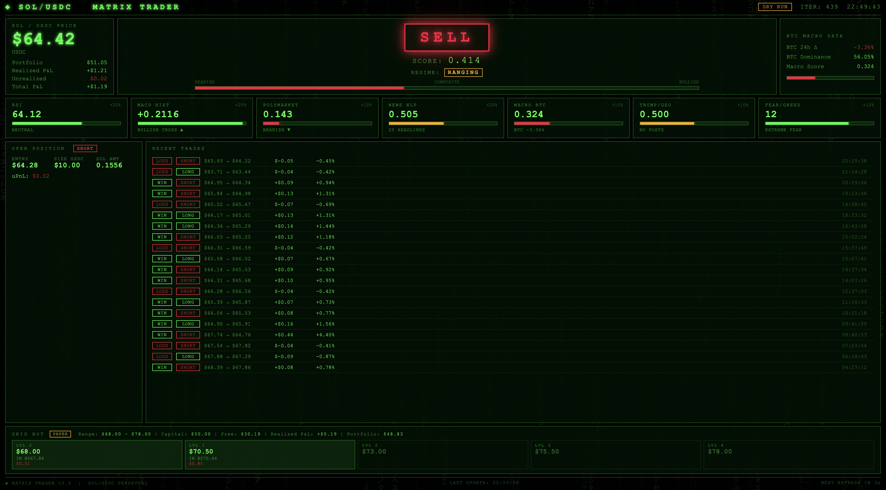
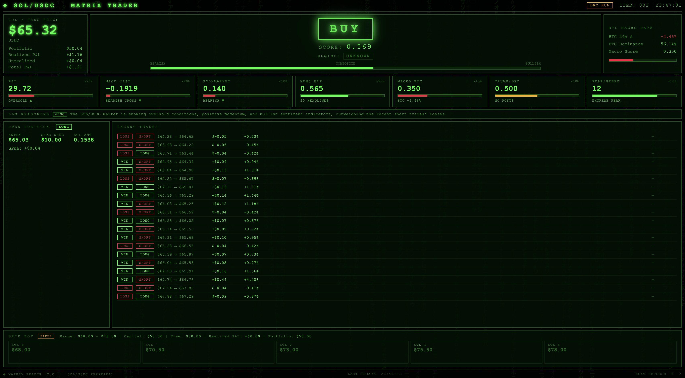

# SOL / USDC Autonomous Trading Bot

An autonomous AI trading agent that makes independent decisions based on 9 signal sources including market sentiment (Fear & Greed, NewsAPI), prediction markets (Polymarket), and technical analysis (RSI, MACD, MA crossover, Stochastic RSI, Bollinger Bands). Built as a learning project to explore how autonomous agents make decisions under uncertainty when multiple heterogeneous data sources provide incomplete, delayed, or conflicting signals.

---

## Live Dashboard



Real-time view on local machine — dashboard auto-refreshes every 5 seconds. Shows current price, composite signal score, per-source signal bars, open positions, recent trades, and the grid bot price chart.

---

## Groq LLM Decision Engine

Decisions are now made by a Groq LLM (llama-3.1-8b-instant) instead of fixed weighted scores. The agent reasons about all 9 signals and explains its decision in natural language.



---

## Agent Architecture

The bot runs as a **ReAct agent** — a continuous loop of Observe → Reason → Act → Reflect:

| Step | What happens |
|---|---|
| **Observe** | Collect 9 signals: price, RSI, MACD, MA cross, Stoch RSI, Bollinger, Polymarket, news, macro, Fear & Greed |
| **Reason** | Groq LLM (llama-3.1-8b-instant) reasons across all signals and explains its decision in natural language |
| **Act** | Execute BUY / SELL / HOLD via Jupiter v6 (live) or paper account (dry run) |
| **Reflect** | Log signal snapshot + trade outcome to SQLite; risk manager updates PnL and drawdown state |

**Heartbeat:** 300 seconds (configurable via `LOOP_INTERVAL_SECONDS`).

**Identity:** [`soul.md`](soul.md) defines the agent's mission, core values, personality, and absolute rules (e.g. never exceed 20% drawdown, minimum 3-tick cooldown between reversals). It is read at startup before the first heartbeat.

**Episodic memory:** SQLite (`trading_bot.db`) persists every trade, signal snapshot, and grid execution across restarts. The last 100 trades are reloaded into memory on startup so the agent's PnL history and risk state are continuous.

---

## Architecture — 5 Layers

```
Layer 1  data/       price_feed.py     CoinGecko SOL/USDC prices + OHLCV bootstrap
                     polymarket.py     Polymarket Gamma API (Fed cuts + BTC $150k)
                     news_sentiment.py NewsAPI + VADER local NLP (7 crypto topics)
                     macro.py          BTC 24h % change + BTC dominance
                     fear_greed.py     Crypto Fear & Greed Index (contrarian)
                     database.py       SQLite persistence (trades, signals, grid)

Layer 2  analysis/   indicators.py     RSI, MACD, MA cross, Stoch RSI, Bollinger Bands
                     regime.py         Trending / choppy / ranging detection (ADX/ATR)

Layer 3  decision/   signal_engine.py  Weighted composite signal → BUY / SELL / HOLD

Layer 4  risk/       risk_manager.py   Position sizing, SL/TP, drawdown guard,
                                       reversal cooldown, long + short slots

Layer 5  execution/  wallet.py         AES-encrypted Solana hot wallet
                     jupiter.py        Jupiter v6 SOL⟷USDC swaps (quote + broadcast)
                     grid_bot.py       Parallel grid strategy (paper trading)
```

---

## Signal Weights

| Source | Weight | Notes |
|---|---|---|
| News NLP | 20% | NewsAPI + local VADER — real-time crypto sentiment |
| RSI | 15% | Wilder's RSI, oversold/overbought zones |
| MACD | 15% | Histogram momentum + zero-line crossover |
| MA Cross | 13% | MA50 vs MA200 — bull/bear trend bias |
| Stoch RSI | 10% | Stochastic of RSI — oversold/overbought momentum |
| Bollinger | 10% | Price position within 2σ bands — mean-reversion signal |
| Polymarket | 7% | Fed rate cut expectations + BTC $150k probability |
| Macro BTC | 5% | BTC 24h change (tanh) + dominance (linear) |
| Fear & Greed | 5% | Contrarian: extreme fear → bullish, extreme greed → bearish |

60% of weight is now technical indicators. Composite score in [0, 1]. If a source is
unavailable its weight is redistributed proportionally across active sources — no
phantom neutral votes.

**Thresholds (defaults):** score ≥ 0.50 → BUY · score ≤ 0.48 → SELL · else HOLD

---

## Capital Split

Total capital is divided 50/50 at startup:

- **Signal bot** (50%) — threshold-gated, managed by `RiskManager`
- **Grid bot** (50%) — always-on oscillation strategy, managed by `GridBot`

Both run concurrently every tick.

---

## Grid Bot

The grid bot runs in parallel with the signal bot and does not depend on signal scores.

- **Capital:** 50% of `INITIAL_CAPITAL_USDC` (default $50)
- **Levels:** 5 equally-spaced price bands
- **Range:** set once on first tick from bootstrapped OHLCV (min × 0.99 → max × 1.01)
- **Logic:** price falling through a level → virtual BUY; price rising while holding → virtual SELL + record PnL to SQLite
- **Mode:** paper trading only; grid trades are logged to `grid_trades` table

---

## SQLite Persistence

All trade and signal data is stored in `trading_bot.db` (project root, gitignored).

| Table | Contents |
|---|---|
| `trades` | Every closed signal-bot position (entry, exit, PnL, reason) |
| `signal_history` | Every tick's composite score and per-source values |
| `grid_trades` | Every completed grid-level sell (level, entry, exit, PnL) |

On restart the bot loads the last 100 trades from the DB so `realized_pnl` and the
dashboard's Recent Trades panel are correct immediately — no warm-up period.

Stats endpoint: **http://localhost:8080/stats**

---

## Built with

Developed with the assistance of Claude AI (Anthropic) as a coding and architecture partner.

---

## Quick Start

### 1. Install dependencies

```bash
cd TRADING-BOT
pip install -r requirements.txt
pip install vaderSentiment   # not in requirements.txt — install separately
```

### 2. Configure environment

```bash
cp .env.example .env
# Edit .env — Telegram tokens and NewsAPI key are optional; bot runs without them.
```

### 3. Run in paper-trading mode (default, no wallet needed)

```bash
python main.py
```

Open **http://localhost:8080** for the live dashboard.

---

## Live Trading Setup

> **Warning:** Live trading involves real funds. Test thoroughly in paper mode first.

### Step 1 — Generate a hot wallet

```bash
python generate_wallet.py
```

Copy the three lines it prints into `.env`:

```env
WALLET_PUBLIC_KEY=...
WALLET_PRIVATE_KEY_ENCRYPTED=...
WALLET_ENCRYPTION_KEY=...
```

### Step 2 — Fund the wallet

Send USDC (and ~0.01 SOL for gas) to the `WALLET_PUBLIC_KEY` address.

### Step 3 — Enable live mode

```env
DRY_RUN=false
TRADE_AMOUNT_USDC=10.0
```

### Step 4 — Start the bot

```bash
python main.py
```

> Short positions are paper-only in live mode. Only long positions execute via Jupiter.

---

## Backtesting

```bash
python main.py --backtest 90    # 90-day backtest
python main.py --backtest 365   # 1-year backtest
```

Output: strategy PnL vs buy-and-hold, win rate, profit factor, max drawdown,
annualised Sharpe. Backtest uses RSI + MACD only (live API signals not available).

---

## Preset Modes

### CONSERVATIVE_MODE — 5-min intervals

Validated on a 365-day backtest (May 2025 → May 2026, −52% SOL bear market):

| Metric | Result |
|---|---|
| Strategy PnL | **+0.3%** |
| Buy & hold | −52.6% |
| Profit factor | **2.49** |
| Win rate | 30% |
| Max drawdown | **2.3%** |
| Sharpe (ann.) | 0.44 |

```env
LOOP_INTERVAL_SECONDS=300
BUY_THRESHOLD=0.58
SELL_THRESHOLD=0.38
STOP_LOSS_PCT=0.03
TAKE_PROFIT_PCT=0.06
```

### LIVE_MODE — 60s tick, tight stops

```env
LOOP_INTERVAL_SECONDS=60
BUY_THRESHOLD=0.45
SELL_THRESHOLD=0.55
STOP_LOSS_PCT=0.001
TAKE_PROFIT_PCT=0.002
```

---

## Telegram Alerts

1. Message **@BotFather** → `/newbot` → copy token
2. Message **@userinfobot** → copy numeric chat ID
3. Add to `.env`:

```env
TELEGRAM_BOT_TOKEN=123456:ABC...
TELEGRAM_CHAT_ID=987654321
```

Sends: startup · every trade · hourly PnL report · shutdown summary.

---

## Configuration Reference

| Variable | Default | Description |
|---|---|---|
| `DRY_RUN` | `true` | Paper trading — no real swaps |
| `LOOP_INTERVAL_SECONDS` | `300` | Tick interval |
| `INITIAL_CAPITAL_USDC` | `100.0` | Total capital (split 50/50 with grid) |
| `TRADE_AMOUNT_USDC` | `10.0` | USDC per signal trade |
| `MAX_POSITION_SIZE_PCT` | `0.25` | Max 25% of free USDC per trade |
| `MAX_DRAWDOWN_PCT` | `0.15` | Halt new trades at −15% drawdown |
| `STOP_LOSS_PCT` | `0.004` | Long stop-loss (0.4%) |
| `TAKE_PROFIT_PCT` | `0.008` | Long take-profit (0.8%) |
| `SHORT_STOP_LOSS_PCT` | `0.004` | Short stop-loss |
| `SHORT_TAKE_PROFIT_PCT` | `0.008` | Short take-profit |
| `REVERSAL_COOLDOWN_TICKS` | `3` | Ticks before reversing direction |
| `BUY_THRESHOLD` | `0.62` | Composite score ≥ this → BUY |
| `SELL_THRESHOLD` | `0.38` | Composite score ≤ this → SELL |
| `RSI_PERIOD` | `14` | RSI lookback |
| `RSI_OVERSOLD` | `30` | RSI buy zone |
| `RSI_OVERBOUGHT` | `70` | RSI sell zone |
| `MACD_FAST` | `12` | MACD fast EMA |
| `MACD_SLOW` | `26` | MACD slow EMA |
| `MACD_SIGNAL_PERIOD` | `9` | MACD signal EMA |
| `DASHBOARD_PORT` | `8080` | Local dashboard port |

---

## Dashboard

The bot writes `data.json` after every tick. The dashboard polls it every 5 seconds.
No build step — vanilla HTML served by Python's built-in HTTP server.

**http://localhost:8080** · Stats API: **http://localhost:8080/stats**

---

## File Layout

```
TRADING-BOT/
├── main.py                   # Orchestrator + CLI entry point
├── config.py                 # Env-var config (loaded once at import)
├── generate_wallet.py        # One-shot wallet generator
├── requirements.txt
├── .env.example              # Template — copy to .env
├── data.json                 # Live state (written by bot, read by dashboard)
│
├── layers/
│   ├── data/
│   │   ├── price_feed.py     # CoinGecko SOL price + OHLCV bootstrap
│   │   ├── polymarket.py     # Polymarket Gamma API sentiment
│   │   ├── news_sentiment.py # NewsAPI + VADER NLP
│   │   ├── macro.py          # BTC direction + dominance
│   │   ├── fear_greed.py     # Crypto Fear & Greed Index (contrarian)
│   │   └── database.py       # SQLite: trades, signals, grid_trades
│   ├── analysis/
│   │   ├── indicators.py     # RSI, MACD, MA cross, Stoch RSI, Bollinger Bands
│   │   └── regime.py         # Market regime detection (ADX/ATR)
│   ├── decision/
│   │   └── signal_engine.py  # Weighted signal aggregation
│   ├── risk/
│   │   └── risk_manager.py   # Position sizing, SL/TP, drawdown, shorts
│   └── execution/
│       ├── wallet.py         # AES-encrypted keypair
│       ├── jupiter.py        # Jupiter v6 quote + swap
│       └── grid_bot.py       # Parallel grid strategy
│
├── alerts/
│   └── telegram.py           # Telegram Bot API notifications
│
├── dashboard/
│   ├── server.py             # HTTP server (port 8080) + /stats endpoint
│   └── index.html            # Dark-theme dashboard (Chart.js)
│
└── backtesting/
    ├── data_loader.py        # Historical OHLCV from CoinGecko
    └── engine.py             # Replay engine + statistics
```

---

## Disclaimer

This software is for educational purposes only. Cryptocurrency trading involves
substantial risk of loss. Past backtest performance does not guarantee future results.
Never trade more than you can afford to lose.
